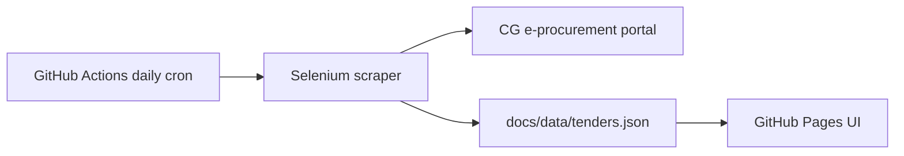

# CG E-Procurement Tender Tracker

Free, automated tracker for Chhattisgarh government open tenders.

- **Scraper** runs daily via GitHub Actions (free)
- **UI** hosted on GitHub Pages (free)
- **No server cost** — everything runs on GitHub

## Live site

After deployment, your site will be at:

```
https://<your-github-username>.github.io/cgproc/
```

## How it works



1. GitHub Actions runs the scraper every day at 6:00 AM IST
2. New tenders are saved to `docs/data/tenders.json`
3. The static UI in `docs/index.html` reads that JSON and displays tenders

## Deploy to GitHub (one-time setup)

### 1. Create a GitHub repository

```bash
git init
git add .
git commit -m "Initial commit: CG tender tracker"
git branch -M main
git remote add origin https://github.com/<your-username>/cgproc.git
git push -u origin main
```

### 2. Enable GitHub Pages

1. Open your repo on GitHub
2. Go to **Settings → Pages**
3. Under **Build and deployment**, set:
   - **Source:** Deploy from a branch
   - **Branch:** `main`
   - **Folder:** `/docs`
4. Click **Save**

Your UI will be live in 1–2 minutes.

### 3. Enable GitHub Actions

1. Go to **Actions** tab in your repo
2. If prompted, click **I understand my workflows, go ahead and enable them**
3. Open **Daily Tender Scrape** workflow
4. Click **Run workflow** to fetch tenders immediately

After the first successful run, `docs/data/tenders.json` will be updated and the UI will show tenders.

## Daily schedule

The workflow runs automatically at **6:00 AM IST** every day.

You can also trigger it manually anytime from the **Actions** tab → **Daily Tender Scrape** → **Run workflow**.

## Local development

```bash
python -m venv .venv
.venv\Scripts\activate        # Windows
pip install -r requirements-core.txt

# Fetch tenders locally
python run_daily.py --import-json --export-json

# Optional: run Flask UI locally
python web/app.py
```

## Project structure

```
cgproc/
├── .github/workflows/daily-scrape.yml   # Daily automation
├── docs/
│   ├── index.html                       # GitHub Pages UI
│   └── data/tenders.json                # Tender data (updated by Actions)
├── scraper/                             # Selenium scraper modules
├── database.py                          # SQLite + JSON export
├── run_daily.py                         # Scraper entry point
└── requirements-core.txt                # Minimal dependencies
```

## Important notes

- **GitHub Actions free tier:** Public repos get unlimited minutes. Private repos have a monthly limit.
- **First run may take a while:** The scraper opens each new tender one by one.
- **Captcha handling:** The scraper reads the captcha code from the page (same as your original script).
- **Data is stored in the repo:** Each daily run commits updated `tenders.json` to your repository.

## Troubleshooting

| Issue | Fix |
|-------|-----|
| UI shows "No tenders" | Run the GitHub Action manually once |
| Action fails on Chrome | Re-run the workflow; transient failures happen |
| Pages not loading | Check Settings → Pages is set to `/docs` folder |
| Want different run time | Edit cron in `.github/workflows/daily-scrape.yml` |

## License

MIT — use freely.
